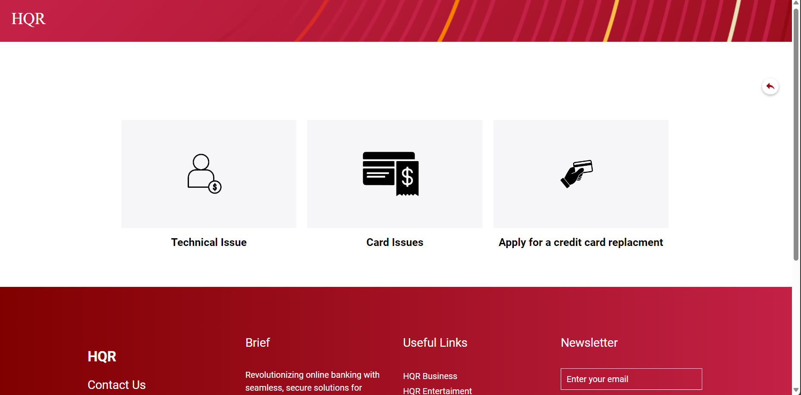

HQR is an online banking platform. This project aims to eradicate the challenges associated with physical bank visits by providing a complete digital banking solution.

# Motivation

This project serves as a learning opportunity to collaborate effectively within a team setting, specifically focusing on the development of the front-end using HTML, CSS, JavaScript. The primary objectives include gaining practical experience in meeting both Functional and Non-Functional Requirements, navigating diverse APIs, and cultivating a consistent coding style.

# Screenshots
- Landing Page

- Login Page

- Client's interface

- Transfers

- Payments

- Redeem Points

- Client's Transactions

- Apply for a credit card

- Apply for a loan

-Open an account

- Report an issue 

-Banker's home page

- Credit Card Applications

- Open/Close bank accounts

- Admin's home page 

 

# Code Style
### Code Formatting
- Use 4-space indentation.
- Line length should not exceed 80 characters.
- End statements with semicolons.

### Naming Conventions
- Variables: camelCase
- Functions: snake_case

### Comments and Documentation
- Use comments to explain complex logic or non-obvious code parts.

### Version Control Practices
- Use concise and descriptive commit messages following the conventional commits specification.

# Installation
1.Clone Repository to your device `https://github.com/software-engineering-2023/Haqarz.git`  
  

  
2.Open ChomePage.html 
  

    
Your default browser should automatically open on the landing page.

# Contribute 
Thank you for considering contributing to our project! We welcome contributions from everyone.
## Contribution Guidelines  

- Fixing Bugs: Fork the repository, create a new branch, and submit a pull request referencing the issue.

#### We appreciate your interest and support in making this project better!  
#### Feel free to modify this template to suit your project's specific guidelines and needs. 

 

 

